# Summary of experiments

In this file, we summarize results of our experiments.
The goal was to train a CNN model for sharks classification tasks.
We intended to compare performance of pretrained ResNet18 model with vanilla CNN trained from scratch.

## ResNet18

The first of the models that we used was [ResNet18](https://arxiv.org/abs/1512.03385).
We finetuned pretrained version from torchvision module by substituting the last layer of classifier.

### Hyperparameters search

We tuned hyperparameters of training scheduler and optimizer such as learning rate, momentum, step size and gamma.
To do so, we used Ray Tune library.
Search space of hyperparameters was as follows:

| Parameter     | Distribution                    |
|---------------|---------------------------------|
| Learning rate | Uniform (0.0001, 0.01)          |
| Momentum      | Uniform (0.05, 0.5)             |
| Step size     | Choice from [1, 2, 4, 6, 8, 10] |
| Gamma         | Uniform (0.05, 0.5)             |

20 models were trained for up to 20 epochs.
Achieved validation accuracy is visualized below:
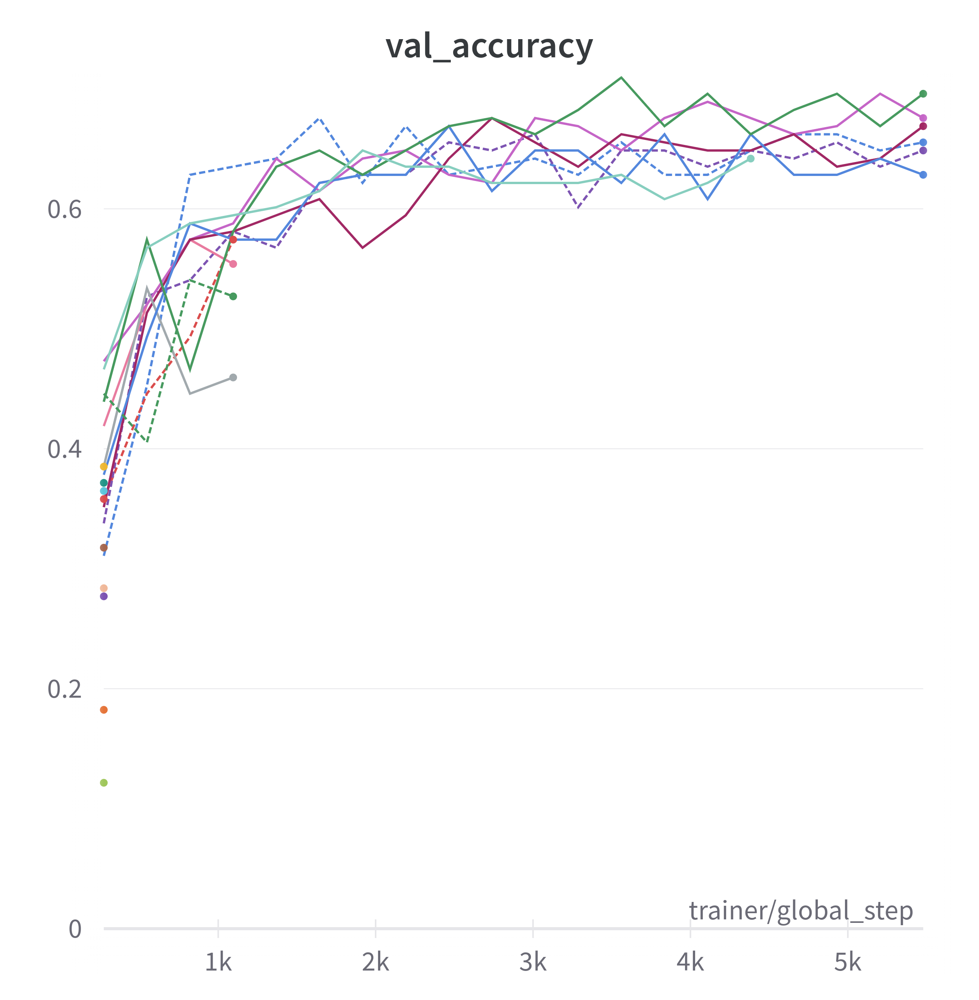

The best model had following hyperparameters: 

| Parameter     | Value                |
|---------------|----------------------|
| Learning rate | 0.004707244812989473 |
| Momentum      | 0.4146024679993903   |
| Step size     | 8                    |
| Gamma         | 0.1292077408885913   |

### Training progress of the best model

**Train accuracy:**
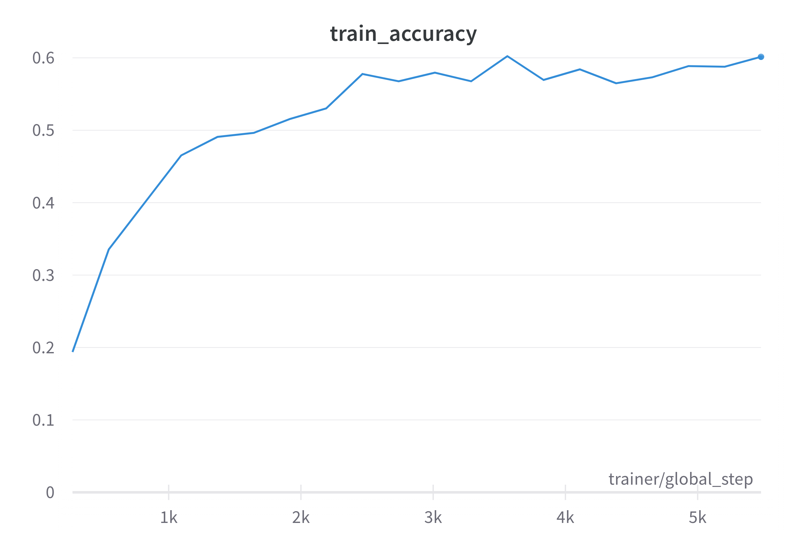

The highest train accuracy, equal to 60.24%, was achieved after 12th epoch.

**Train loss:**
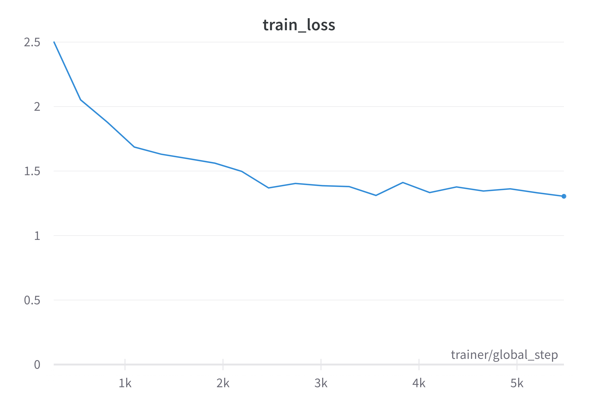

**Validation accuracy:**
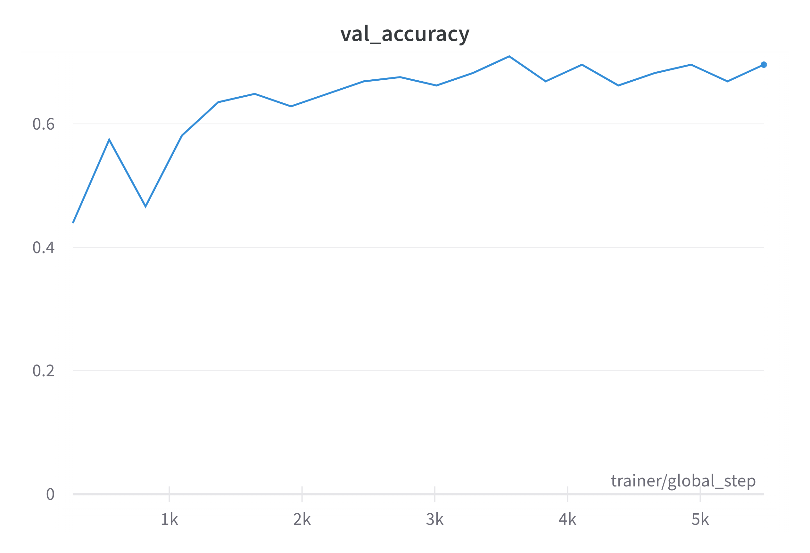

The highest validation accuracy, equal to 70.95%, was achieved after 12th epoch.

**Validation loss:**
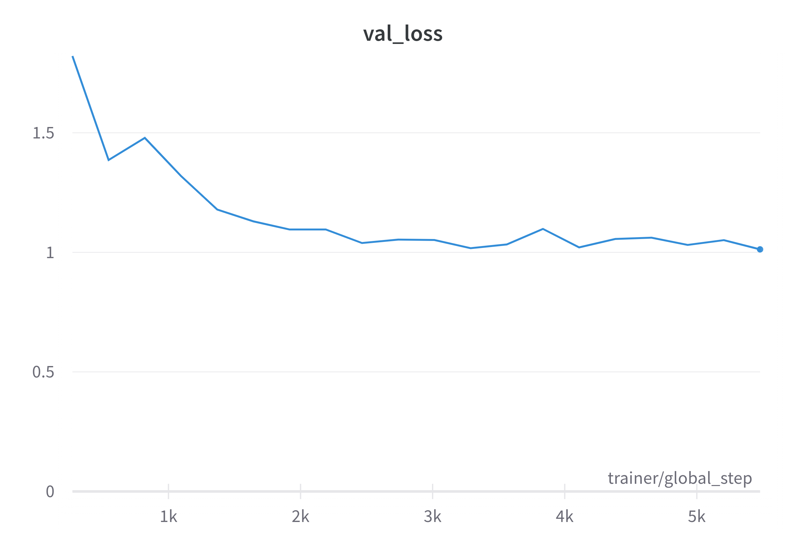

It is surprising that the accuracy and loss results were better on validation rather than training set.
It may be caused by bigger amount of difficult samples in training set and/or data augmentation.

### Results achieved by the best model on test set

#### Metrics

Accuracy was equal to 70.72%, while loss totaled 0.95.

#### Confusion matrix

 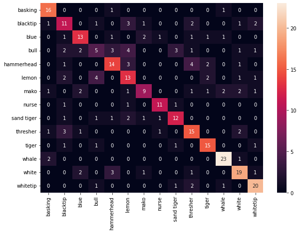

It can be noticed that while the model learned to discern between most of the classes pretty well, it had some problems when it comes to bull sharks.
In that class case, the majority of samples were misclassified.

#### Examples of misclassified images

Some examples of misclassified samples are visualized below.
It can be noticed that in majority of them,
the face of the shark was cropped, which may have caused difficulties while predicting their class.

 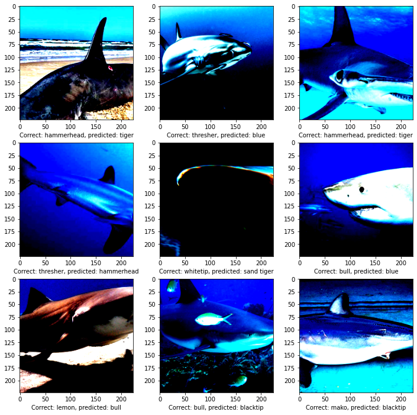
 
## Vanilla CNN

We also trained traditional CNN network, consisting of 2 convolutional layers with ReLU activation function and pooling.
On top of it, classifier head made up of two linear layers was added.
Images was resized to be roughly two times smaller than in ResNet version.
Due to hardware limitations, we were not able to train bigger network.

### Hyperparameters search

We tuned hyperparameters of training scheduler and optimizer such as learning rate, momentum, step size and gamma.
To do so, we used Ray Tune library.
Search space of hyperparameters was as follows:

| Parameter     | Distribution                    |
|---------------|---------------------------------|
| Learning rate | Uniform (0.0005, 0.01)          |
| Momentum      | Uniform (0.05, 0.5)             |
| Step size     | Choice from [1, 2, 4, 6, 8, 10] |
| Gamma         | Uniform (0.05, 0.5)             |

Learning rate was sampled from higher values than in ResNet, the rest of the distributions is the same.
10 models were trained for up to 70 epochs.
Achieved validation accuracy is visualized below:
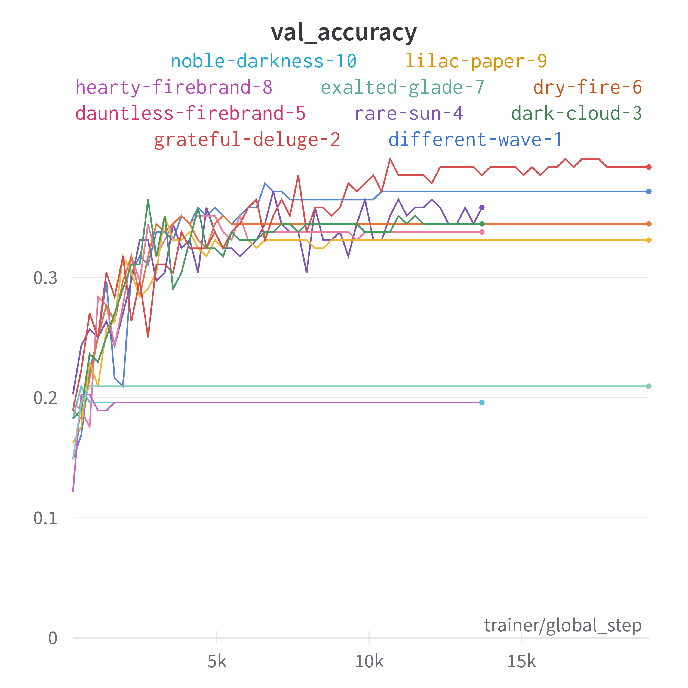

The best model had following hyperparameters: 

| Parameter     | Value                |
|---------------|----------------------|
| Learning rate | 0.004126329405763778 |
| Momentum      | 0.46380255769027745  |
| Step size     | 10                   |
| Gamma         | 0.3002853514448914   |

### Training progress of the best model

**Train accuracy:**
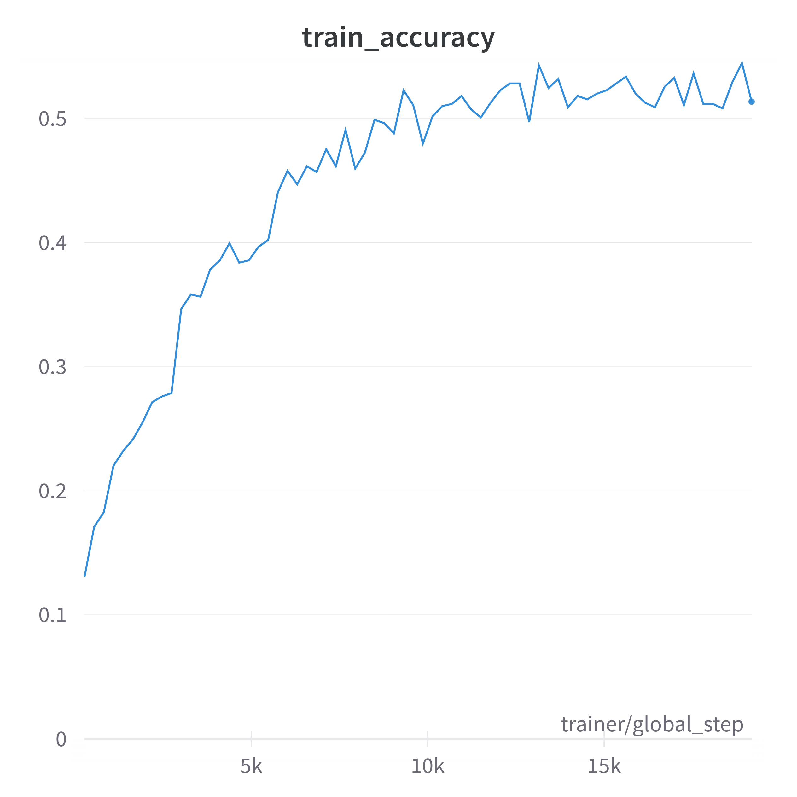

The highest train accuracy, equal to 54.48%%, was achieved after 68th epoch.

**Train loss:**
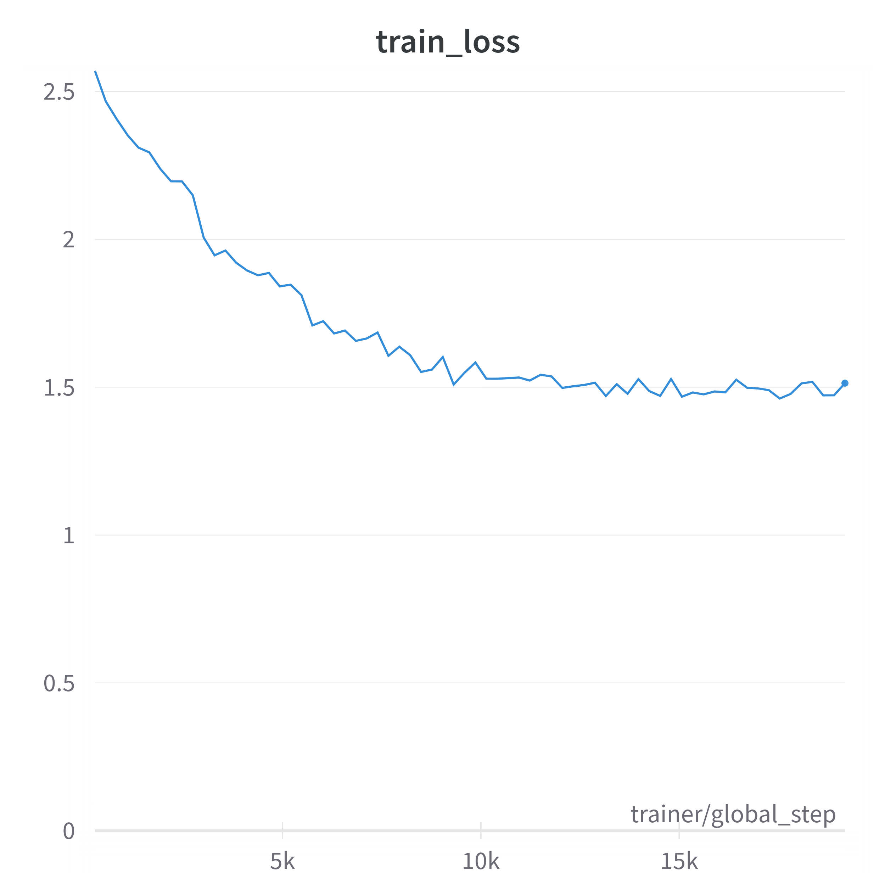

**Validation accuracy:**
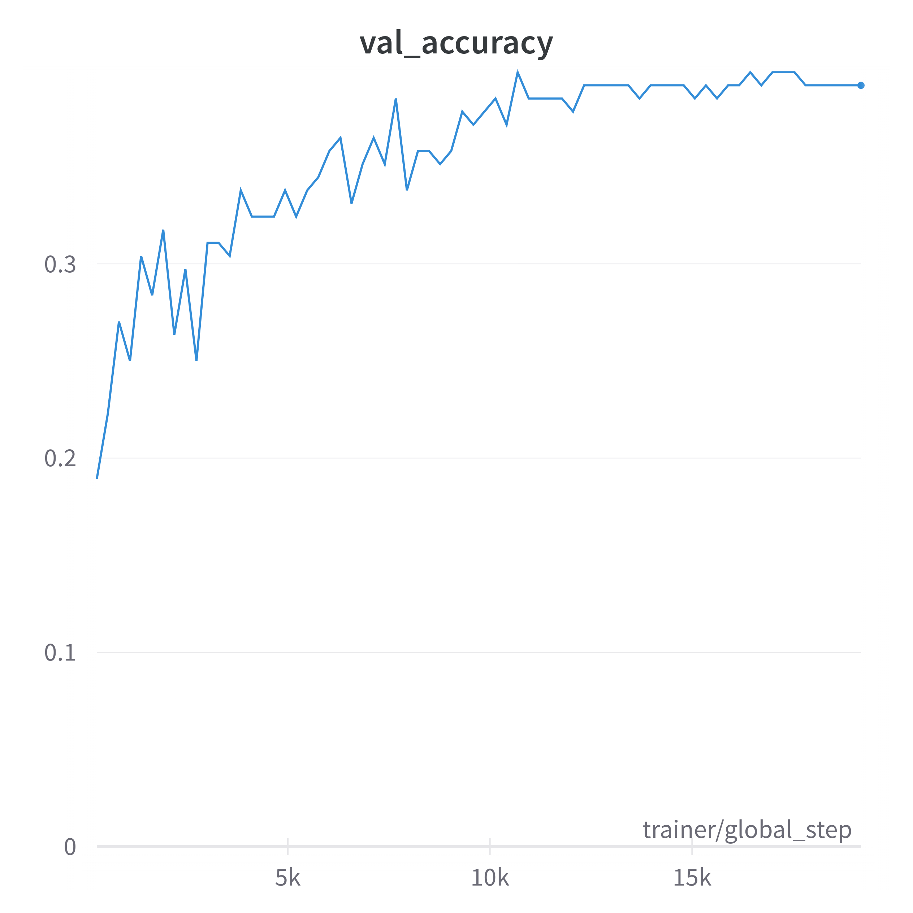

The highest validation accuracy, equal to 39.86%, was achieved after 38th epoch.

**Validation loss:**
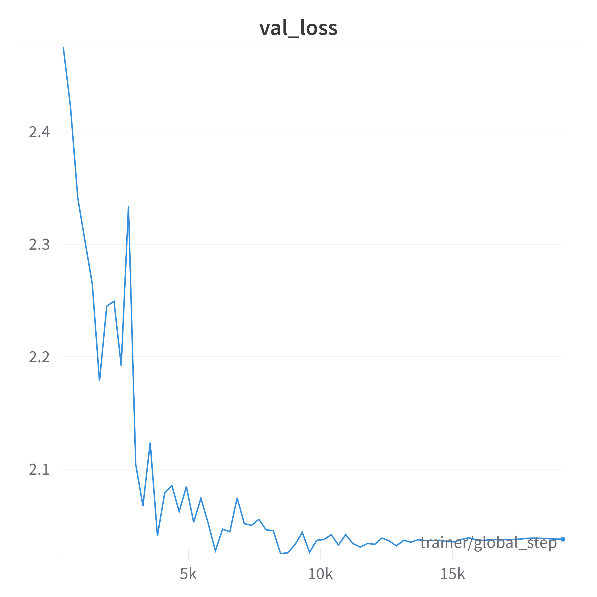

The achieved results are much worse than when using ResNet, which suggest that network is too small to capture complexity of the task.
In contrast to ResNet, here the behaviour of train/validation accuracy is less surprising - as expected, train accuracy is better than for validation set.
They differ by more than 10%, which may be caused by the model not being able to generalise over different degrees of data augmentation.

### Results achieved by the best model on test set

#### Metrics

Accuracy was equal to 37.83%, while loss totaled 1.94.

#### Confusion matrix

 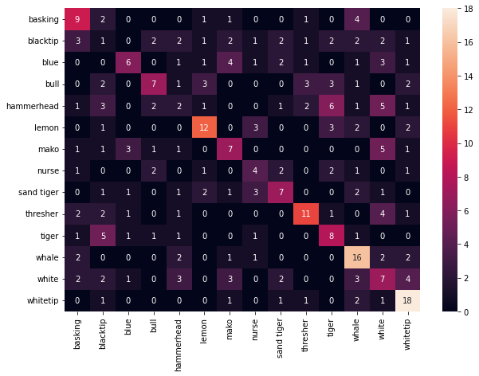

As expected from pretty bad accuracy, confusion matrix of the model predictions on test set is not great.
Only few shark species, such as whitetip, whale or lemon shark are reliably identified.
On the other hand, recognizing blacktip and hammerhead proved to be the most difficult.

#### Examples of misclassified images

Some examples of misclassified samples are visualized below.

 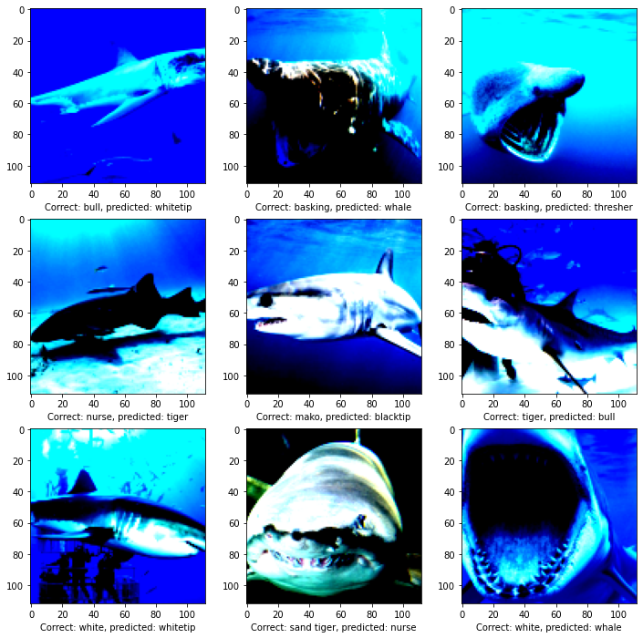